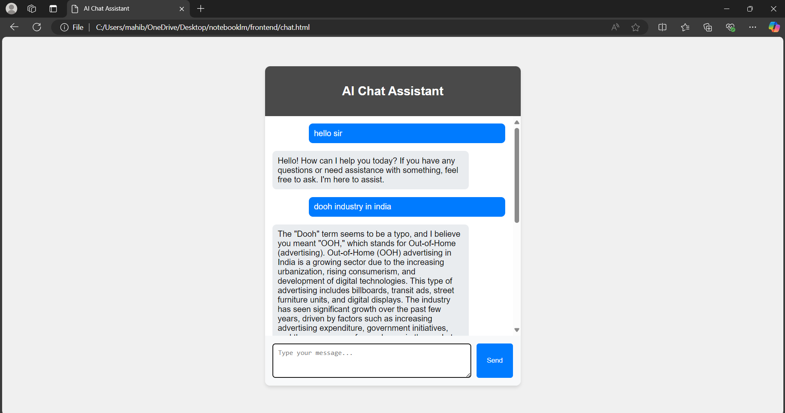
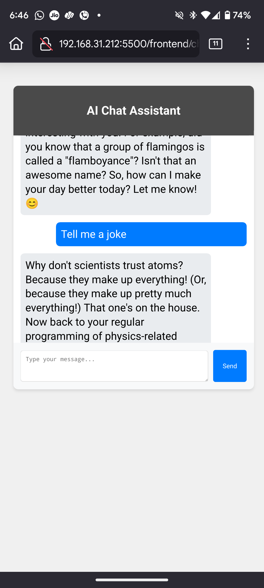

# AI Chat Assistant with Mistral 7B


## Project Overview

This project is an AI Chat Assistant built using Flask and the Mistral 7B model from Ollama. The application allows users to interact with an AI model that generates responses based on user input. The chat history is stored for future reference, making it easy to track conversations.

## Features

- Interactive chat interface
- AI responses generated using the Mistral 7B model
- Chat history storage (using SQLite or JSON)
- Responsive design for mobile and desktop
- Easy setup and deployment

## Prerequisites

Before you begin, ensure you have the following installed on your local machine:

- Python 3.7 or higher
- Flask
- Flask-SQLAlchemy (if using a database)
- Ollama (for the Mistral model)

### Download Mistral 7B Locally

To use the Mistral 7B model, you need to download it locally. Follow these steps:

1. **Install Ollama**: Visit [Ollama's official website](https://ollama.ai/) and follow the installation instructions for your operating system.

2. **Pull the Mistral Model**:
   ```bash
   ollama pull mistral
### Download Mistral Model

### Installation
**Clone the Repository:**

bash
Insert Code
Run
Copy code
git clone https://github.com/yourusername/ai-chat-assistant.git
cd ai-chat-assistant
Create a Virtual Environment (optional but recommended):

bash
Insert Code
Run
Copy code
python -m venv venv
source venv/bin/activate  # On Windows use `venv\Scripts\activate`
Install Required Packages:

bash
Insert Code
Run
Copy code
pip install -r requirements.txt
Set Up the Database (if using SQLite):

bash
Insert Code
Run
Copy code
python -c "from app import db; db.create_all()"
Running the Application
To start the Flask application, run the following command:

bash
Insert Code
Run
Copy code
python app.py
The application will be accessible at http://localhost:5000 in your web browser.

### Usage
Open your web browser and navigate to http://localhost:5000.
Type your message in the input box and press "Send".
The AI will respond based on your input.
### Chat Interface


### Contributing
Contributions are welcome! If you have suggestions for improvements or new features, please open an issue or submit a pull request.

### License
This project is licensed under the MIT License. See the LICENSE file for details.

Acknowledgments
Ollama for providing the Mistral model.
Flask for the web framework.
SQLite for lightweight database storage.
Contact
For any questions or feedback, feel free to reach out:

Email: your.email@example.com
GitHub: yourusername